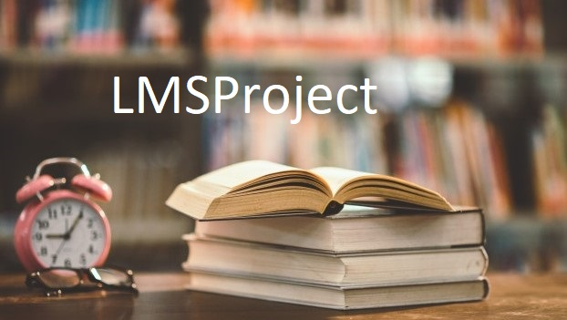

    
  <h3 align="center"><b>LMSProject</b></h3>

LMSProject, a web app made in Django, is an online library management system created as an at ease management of operations of small scaled libraries.

# Problem Statement

- File lost/damaged
- Difficult to search record
- Cost/space consuming

# Overview

## Purpose

LMSProject is an application which refers to library systems which are generally small or medium in size. It is used by librarian/students to access the library using a computerized system. Book/student maintenance modules are also included in this system which would keep track of the students using the library and also a detailed description about the books a library contains.

## Objective

- Improvement in control and performance
- Save cost/time

# Tech-Stack

# Features(Student Module)

- Register/Login
- View account dashboard.
- View available books in the library, issued book and book return date-time.
- Update profile.

# Features(Admin Module)

- Admin Dashboard
- Add/Manage authors, books, category of books,book fees
- Issue a new book to student, notifying students about the return date-time details
- Search student by student ID, view student details

# How To Run The Project?

To run this project, you must have installed <a href= "https://www.python.org/" target="_blank">Python</a> on your PC. After downloading the project, follow the steps below:

Step-1: Extract/unzip the file

Step-2: Go inside the project folder, open cmd and type the following commands to install Django Framework and run the webserver:

        pip install -r requirements.txt
        python manage.py runserver

Step-3: Finally, open the browser and go to localhost:8000
